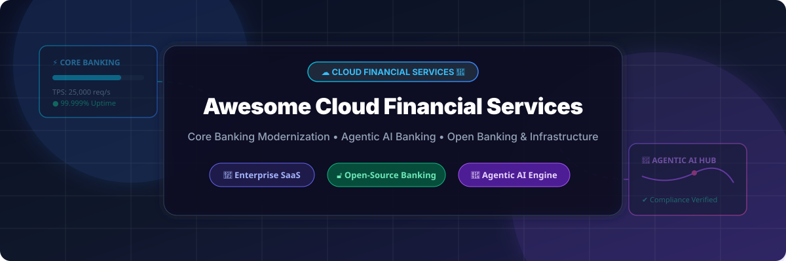

# Awesome Cloud Financial Services Platform 🏦 ☁️

  

  
  
  
  
  

---

## 🌟 Top Cloud Financial Services & Core Banking Ecosystem 🚀

**Curated Directory of Commercial Cloud Banking Platforms, Agentic AI Financial Engines & Open-Source Core Banking Systems**  
*Focused on Core Banking Modernization, Agentic AI Banking, Banking-as-a-Service (BaaS), Open Banking APIs, Regulatory Compliance & Self-Hosted Financial Infrastructure* 💳 🏛️

**Last updated: October 2026** 📅

---

### 📌 Overview & SEO Summary 🔍
Welcome to the ultimate curated directory of **cloud financial services platforms**, **open-source core banking systems**, and **banking-as-a-service (BaaS) frameworks**. Whether you are evaluating enterprise-grade commercial platforms (such as *Microsoft Cloud for Financial Services*, *Google Cloud FSI*, *Temenos Banking Cloud*, *nCino Agentic Banking*, and *Thought Machine Vault Core*), or self-hostable open-source banking engines (like *Apache Fineract*, *Maybe Finance*, *Firefly III*, and *Hyperswitch*), this directory provides exhaustive coverage of market leaders, specific pricing tiers, valuation metrics, and open-source star counts.

---

## 📑 Table of Contents 📖
- [🏢 SaaS & Commercial Platforms](#-saas--commercial-platforms)
- [🔓 Open-Source GitHub Projects](#-open-source-github-projects)
- [🛠️ How to Contribute](#%EF%B8%8F-how-to-contribute)
- [📈 Star History](#-star-history)
- [🤝 Support & Sponsorship](#-support--sponsorship)
- [⚠️ Disclaimer](#%EF%B8%8F-disclaimer)

---

## 🏢 SaaS / Commercial Platforms 💼

> 💡 **Market Size & Industry Structure:** The global Cloud Financial Services & Core Banking market is estimated at **$48.5 Billion in 2026** (projected to reach $92.4 Billion by 2030 at a CAGR of 17.5%). The sector is **moderately fragmented**, with hyperscalers (Microsoft, Google) dominating compliant cloud infrastructure, while core banking giants (Fiserv, FIS, Temenos) and cloud-native innovators (Mambu, Thought Machine, nCino) compete intensely across core processing, composable banking, and agentic AI verticals. 📊 📈

*Sorted by Valuation / Market Cap (Descending)* 💰

| 🏢 SaaS / Commercial Platform | 🏬 Company / Owner | 💰 Valuation / Market Cap | 💵 Standard Edition Starting Price | 🎁 Free Tier / Free Trial Limits | 📝 Description & Core Capabilities |
| :--- | :--- | :--- | :--- | :--- | :--- |
| **[Microsoft Cloud for Financial Services](https://www.microsoft.com/en-us/industry/financial-services)** ☁️ | Microsoft | ~$3.90 Trillion | Pay-as-you-go starting at $0.008/hour (Azure B1s VM) | **Always Free tier** (12 months of 55+ Azure services + $200 30-day trial credit) | **Hyperscaler FSI Platform** — 100+ compliance offerings. Azure landing zones for FSI workloads. Microsoft Purview for data governance and regulatory compliance. Confidential computing & Managed HSM for sensitive workloads. |
| **[Google Cloud Financial Services](https://cloud.google.com/solutions/financial-services)** 🔷 | Google (Alphabet) | ~$2.00 Trillion | Pay-as-you-go starting at $0.0076/hour (e2-micro instance) | **$300 90-day trial credit** + Always Free tier (20+ services incl. 1 e2-micro VM/mo) | **Hyperscaler FSI Infrastructure** — Well-Architected Framework for FSI with multi-zone & multi-region resilience. Native support for Fed, EBA, and PRA compliance standards. |
| **[Fiserv DNA](https://www.fiserv.com/)** 🟢 | Fiserv | ~$90 Billion | Core processing SaaS starting at $2,500/month for small institutions | **30-day interactive developer portal sandbox access** with mock APIs | **Account Processing Platform** — Core banking for commercial banks and credit unions. Open architecture for seamless integration with third-party fintech partners. |
| **[FIS Modern Banking](https://www.fisglobal.com/)** 🔵 | FIS | ~$40 Billion | Digital banking API suite starting at $1,800/month for community banks | **30-day developer portal sandbox access** with 5,000 test calls/month | **Banking & Payments Tech** — Cloud-native core processing, digital banking, and payment solutions serving global financial institutions. |
| **[Temenos Banking Cloud](https://www.temenos.com/)** 🏦 | Temenos AG | ~$5 Billion | Temenos SaaS core tier starting at $5,000/month for neobanks | **30-day Temenos Developer Sandbox** with 10,000 free test API calls | **Enterprise Core Banking** — Temenos Transact for corporate & retail banking. Supports Islamic banking, cooperatives, and non-bank financial institutions with end-to-end automation. |
| **[Mambu](https://www.mambu.com/)** 🏗️ | Mambu | ~$4.9 Billion | Composable core banking starting at $3,000/month per tenant | **30-day sandbox tenant access** with up to 500 active test accounts | **Composable SaaS Core Banking** — API-first core banking platform for banks and fintechs enabling rapid launch of lending, deposit, and savings products. |
| **[Finastra FusionFabric](https://www.finastra.com/)** 🟠 | Finastra | ~$3.5 Billion | FusionFabric API platform starting at $750/month for app hosting | **30-day free trial** on FusionFabric.cloud developer portal with mock open banking APIs | **Open Banking Platform** — FusionFabric.cloud for building and deploying financial applications across core banking, lending, and treasury management. |
| **[nCino Agentic Banking](https://www.ncino.com/)** 🤖 | nCino, Inc. | ~$3 Billion | Commercial onboarding package starting at $1,200/user/year | **14-day guided sandbox demo environment** with pre-loaded mock portfolio data | **Agentic AI Banking Platform** — 2,700+ customers globally (Bank of America, Barclays, Santander). Agentic Operating System (AOS) enables auditable AI agents. Banking Advisor reduced document search times by 97.5% at ConnectOne Bank. |
| **[Thought Machine Vault Core](https://www.thoughtmachine.net/)** 🧠 | Thought Machine | ~$2.7 Billion | Core engine SaaS deployment starting at $4,000/month for neobanks | **30-day Vault Core Lab sandbox environment** with pre-built smart contracts | **Cloud-Native Core Banking** — Built from scratch without legacy code using smart contracts to configure financial products. 200+ preconfigured products. Trusted by JPMorgan Chase, Lloyds, Standard Chartered, and ING. |

---

## 🔓 Open-Source GitHub Projects 🌐

*Sorted by GitHub Stars Count (Descending)* 🌟

- **[Maybe Finance](https://github.com/maybe-finance/maybe)**   
  **AI-powered personal finance & wealth management platform**, AGPL-3.0 licensed. **Budgeting, investing, and financial planning**. Open-source alternative to Mint. **42,000+ stars**. The most popular open-source personal finance engine. 💰

- **[ERPNext](https://github.com/frappe/erpnext)**   
  **Open-source enterprise resource planning with core accounting**, GPL-3.0 licensed. **Full accounting ledger, general ledger, tax compliance, invoicing, and treasury management**. **23,800+ stars**. Comprehensive financial foundation for businesses. 📊

- **[Firefly III](https://github.com/firefly-iii/firefly-iii)**   
  **Free and open-source personal finance manager**, AGPL-3.0 licensed. **Self-hosted banking dashboard**, automated transaction tagging, double-entry bookkeeping, multi-currency support, and budget tracking. **16,500+ stars**. 🏦

- **[Actual Budget](https://github.com/actualbudget/actual)**   
  **Super-fast local-first personal finance system**, MIT licensed. **Privacy-centric budgeting app** with optional bank sync via Nordigen/Plaid, multi-device sync, and custom reports. **15,200+ stars**. 💳

- **[Hyperswitch](https://github.com/juspay/hyperswitch)**   
  **Open-source financial payment router & orchestrator**, Apache-2.0 licensed. **Connects to 50+ payment gateways**, smart routing logic, payment vaulting, and compliance processing for fintech platforms. **12,500+ stars**. ⚡

- **[Invoice Ninja](https://github.com/invoiceninja/invoiceninja)**   
  **Invoicing, expense tracking, and client management platform**, Elastic License 2.0. **Free invoicing for small businesses, freelancers, and fintech services**. **8,600+ stars**. 🧾

- **[Akaunting](https://github.com/akaunting/akaunting)**   
  **Online accounting software for small businesses**, GPL-3.0 licensed. **Invoicing, expense tracking, and financial reporting**. Open-source QuickBooks alternative. **8,300+ stars**. 📒

- **[Ghostfolio](https://github.com/ghostfolio/ghostfolio)**   
  **Open-source wealth management & portfolio tracking**, AGPL-3.0 licensed. **Tracks stocks, ETFs, crypto, and cash accounts** across multiple bank profiles. **5,400+ stars**. 📈

- **[Kill Bill](https://github.com/killbill/killbill)**   
  **Open-source billing and payment platform**, Apache-2.0 licensed. **Enterprise subscription management, invoice generation, payment gateway integration, and financial ledgering**. **5,200+ stars**. 🔄

- **[Apache Fineract](https://github.com/apache/fineract)**   
  **Open-source core banking platform**, Apache-2.0 licensed. **Cloud-ready core banking system** providing digital financial services for unbanked and underbanked populations. Deployed in **500+ institutions serving 20M+ individuals across 56 countries**. **2,100+ stars**. 🏛️

- **[Ballerine](https://github.com/ballerine-io/ballerine)**   
  **Open-source risk management & KYC/KYB platform**, Apache-2.0 licensed. **Enables rapid customer onboarding, underwriting, and continuous risk monitoring** for financial institutions. **2,000+ stars**. 🛡️

- **[Midaz Core Ledger](https://github.com/lerianstudio/midaz)**   
  **Open-source financial ledger engine for multi-currency transaction accounting**, Apache-2.0 licensed. **Immutable, highly performant financial transaction ledger** designed for neobanks and payment platforms. **1,800+ stars**. 🧱

- **[Open Bank Project](https://github.com/OpenBankProject/OBP-API)**   
  **Open source RESTful API for banks**, AGPL-3.0 licensed. **Enables PSD2 / Open Banking compliance**, secure OAuth authentication, and developer access to core banking systems. **1,500+ stars**. 🌐

- **[Mifos X](https://github.com/openMF/mifosx)**   
  **Reference web & mobile applications for Apache Fineract**, MPL-2.0 licensed. Out-of-the-box frontend UI, staff portals, customer mobile apps, and reporting suites for Fineract. **1,200+ stars**. 📱

- **[WSO2 Micro Integrator](https://github.com/wso2/product-mi-tooling)**   
  **Open-source integration layer for banking modernization**, Apache-2.0 licensed. Decouples core banking (e.g. Temenos T24) from third-party APIs. Used by Nib International Bank for wallet and digital payment integration. **500+ stars**. 🔗

- **[Cyclos](https://github.com/cyclosproject/cyclos4)**   
  **Free and open-source banking software**, AGPL-3.0 licensed. Features for credit unions, microfinance institutions, and local payment systems. **200+ stars**. 🔁

- **[MyBANCO](https://github.com/MyBANCO/mybanco)**   
  **Free open-source core banking software**, open-source licensed. Modular core banking application designed for community banks and microfinance institutions. **50+ stars**. 🏗️

---

## 🛠️ How to Contribute 🤝

Contributions are welcome! Follow these steps to submit new cloud financial services platforms or open-source banking software:

1. 🍴 **Fork** the repository.
2. 📝 **Add/edit** entries in `README.md` maintaining table/list structure and formatting.
3. 🔗 Include project title, official website/GitHub link, exact star badge, license, and brief description.
4. 🚀 Submit a **Pull Request** with a descriptive summary of your changes.

---

## 📈 Star History ⭐

---

## 🤝 Support & Sponsorship ☕

If you find this cloud financial services platform repository useful, please consider supporting the project:

- ⭐ **Star** this repository to increase visibility and help others discover it!
- 🔀 **Fork** and share with fellow fintech engineers, banking architects, and open-source advocates.
- ☕ **Buy Me a Coffee / Sponsor**: Support ongoing open-source curation via the [GitHub Sponsor Dashboard](https://github.com/sponsors/ishandutta2007).

---

## ⚠️ Disclaimer 🔒

- This is a **community-curated** directory — not exhaustive and not an endorsement. ℹ️
- **Core banking systems are distinct from general accounting software** — core banking handles deposit processing, loan origination, ledger posting, payment clearing, and regulatory reporting. **Apache Fineract is production-proven** in 500+ institutions across 56 countries, but requires dedicated operational expertise.
- **Agentic AI in banking requires strict governance** — every AI-assisted action (e.g. nCino AOS) must be auditable, explainable, and bound by institutional security controls.
- **Thought Machine Vault Core is cloud-agnostic** — usable across AWS, GCP, Azure, or private cloud environments.
- **Always validate regulatory compliance** (GDPR, PCI-DSS, SOC2, Fed/EBA rules) before deploying financial infrastructure. 🏦

---

  <b>Made with ❤️ for fintech engineers, banking architects, and open-source financial infrastructure advocates.</b>

